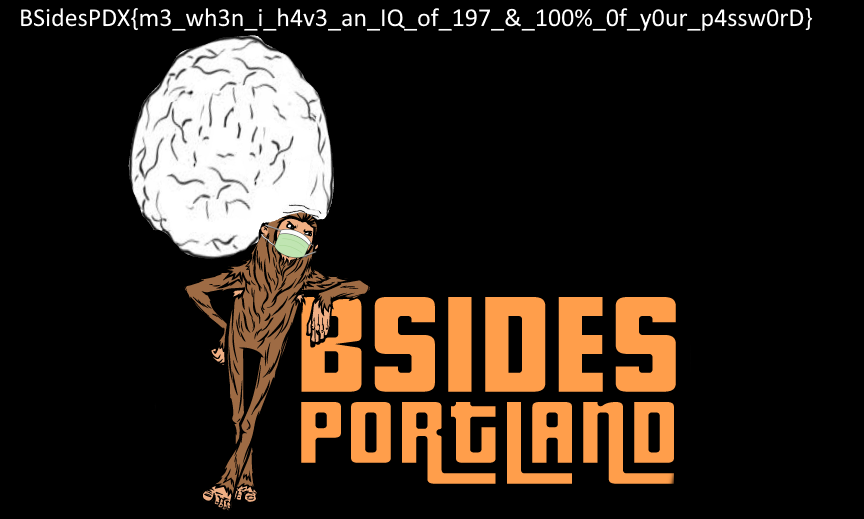

# RE200 - flagvault.c - Solution

## Basic analysis

It's good to start with collecting basic information about the binary. The `file` command on Linux is a good start.

```
flagvault: ELF 64-bit LSB shared object, x86-64, version 1 (SYSV), dynamically linked, interpreter /lib64/ld-linux-x86-64.so.2, BuildID[sha1]=3b72b54fbcf6e274034da6087d1a60a650abd54b, for GNU/Linux 3.2.0, stripped
```

So this is an x86-64 binary that has been stripped of symbols, so that means it will probably be missing function names.

## Running the binary

Let's try running the binary (it's good practice to only run unknown binaries in an isolated VM).

```
$ ./flagvault 

Usage:

  ::Encrypt::
	./flagvault -e -p <plaintxtfile (input)> -c <encryptedfile (output)>
  ::Decrypt::
	./flagvault -d -c <encryptedfile (input)> -p <plaintxtfile (output)>

Error: Must specifiy both an encryptedfile and a plaintextfile
```

The binary gives us a helpful usage message on what args to use, so let's just see what happens if we tell it to decrypt the provided file.

```
$ ./flagvault -d -c flag.png.enc -p flag.png
Enter password: 
```

It wants a password.. Just like the previous challenge.  Let's just give it something arbitrary like `AAAAAAAA`.

```
$ ./flagvault -d -c flag.png.enc -p flag.png
Enter password: AAAAAAAA
Wrong password supplied!
```

Ok, so let's try and figure out how it's deciding to print `Wrong password supplied!`.

## Decompile with Ghidra

I wrote a [write-up last year](https://github.com/BSidesPDX/CTF-2019/tree/master/re/100-magicnumbers/solution#decompile-with-ghidra) that included information on loading the binary into Ghidra for analysis, so if this is your first time using Ghidra, I recommend checking that out for more information.  Otherwise, I'll assume you've got the binary loaded.

To find usages of our string, let's click `Search -> For Strings` in the ghidra toolbar and search for `Wrong password supplied!`.  Once you find it, you can click `XREF` to find where it's being referenced.

Weird, we followed the xref, but the decompiler isn't working, it says `No Function`.  Maybe this is the wrong approah, let's take a step back and try to find `main`.  

Using the Symbol Tree panel on the left, click on `entry` under the `Functions` portion.  It should decompile to the following:

```c
void entry(undefined8 param_1,undefined8 param_2,undefined8 param_3)

{
  undefined8 in_stack_00000000;
  undefined auStack8 [8];
  
  __libc_start_main(FUN_00101d0d,in_stack_00000000,&stack0x00000008,&LAB_00102050,&DAT_001020c0,
                    param_3,auStack8);
  do {
                    /* WARNING: Do nothing block with infinite loop */
  } while( true );
}
```

If we google `__libc_start_main`, [this is the first result](https://refspecs.linuxbase.org/LSB_3.1.0/LSB-generic/LSB-generic/baselib---libc-start-main-.html).

```
Synopsis

int __libc_start_main(int *(main) (int, char * *, char * *), int argc, char * * ubp_av, void (*init) (void), void (*fini) (void), void (*rtld_fini) (void), void (* stack_end));

Description

The __libc_start_main() function shall perform any necessary initialization of the execution environment, call the main function with appropriate arguments, and handle the return from main(). If the main() function returns, the return value shall be passed to the exit() function. 
```

So `main` is passed as the first argument to `__libc_start_main`.  That means `main` must be at `FUN_00101d0d`.  Let's click on this.

Hmm, the decompiler window still shows `No Function`.  But at least we know we're at the start of main, so let's do `Right Click -> Creat Function`.  The decompiler window should now be populated with source!

```c
undefined8 FUN_00101d0d(int param_1,char **param_2)

{
  bool bVar1;
  bool bVar2;
  char cVar3;
  int iVar4;
  undefined8 uVar5;
  size_t sVar6;
  void *__src;
  code *__dest;
  long in_FS_OFFSET;
  uint local_d4;
  char *local_c8;
  char *local_c0;
  char local_98 [136];
  long local_10;
  
  local_10 = *(long *)(in_FS_OFFSET + 0x28);
  local_c8 = (char *)0x0;
  local_c0 = (char *)0x0;
  bVar1 = false;
  bVar2 = false;
  while (iVar4 = getopt(param_1,param_2,"hedp:c:"), iVar4 != -1) {
    switch(iVar4) {
    case 99:
      local_c0 = optarg;
      break;
    case 100:
      bVar2 = true;
      break;
    case 0x65:
      bVar1 = true;
      break;
    case 0x68:
      FUN_00101cbb();
      uVar5 = 1;
LAB_00102031:
      if (local_10 != *(long *)(in_FS_OFFSET + 0x28)) {
                    /* WARNING: Subroutine does not return */
        __stack_chk_fail();
      }
      return uVar5;
    case 0x70:
      local_c8 = optarg;
    }
  }
  if ((bVar1) && (bVar2)) {
    FUN_00101cbb();
    uVar5 = FUN_00101cde("Can not use both -e(encrypt) and -d(decrypt) arguments at the same time\n"
                        );
    goto LAB_00102031;
  }
  if ((local_c8 == (char *)0x0) || (local_c0 == (char *)0x0)) {
    FUN_00101cbb();
    uVar5 = FUN_00101cde("Must specifiy both an encryptedfile and a plaintextfile\n");
    goto LAB_00102031;
  }
  printf("Enter password: ");
  __isoc99_scanf("%127s",local_98);
  sVar6 = strlen(local_98);
  if (bVar1) {
    FUN_001014e9(local_c8,local_c0,local_98);
    goto LAB_0010202c;
  }
  if (bVar2) {
    __src = malloc(0x295);
    local_d4 = 0;
    while (local_d4 < 0x295) {
      *(byte *)((long)__src + (long)(int)local_d4) = (&DAT_001030e0)[(int)local_d4] ^ 0x66;
      local_d4 = local_d4 + 1;
    }
    __dest = (code *)mmap((void *)0x0,0x295,3,0x21,-1,0);
    memcpy(__dest,__src,0x295);
    mprotect(__dest,0x295,5);
    cVar3 = (*__dest)(local_98,sVar6 & 0xffffffff,sVar6 & 0xffffffff,__dest);
    if (cVar3 == '\0') {
      puts("Wrong password supplied!");
    }
    else {
      FUN_001018bb(local_c0,local_c8,local_98);
    }
LAB_0010202c:
    uVar5 = 0;
    goto LAB_00102031;
  }
  FUN_00101cbb();
  uVar5 = FUN_00101cde("Missing either -e(encrypt) or -d(decrypt) argument\n");
  goto LAB_00102031;
}
```

Toward the top, we can see a call to `getopt`.  Invoking `man getopt` indicates this is for handling CLI arguments.  For now, let's skip this and focus more closely on the handling of the password.

```c
  printf("Enter password: ");
  __isoc99_scanf("%127s",local_98);
  sVar6 = strlen(local_98);
  if (bVar1) {
    FUN_001014e9(local_c8,local_c0,local_98);
    goto LAB_0010202c;
  }
  if (bVar2) {
    __src = malloc(0x295);
    local_d4 = 0;
    while (local_d4 < 0x295) {
      *(byte *)((long)__src + (long)(int)local_d4) = (&DAT_001030e0)[(int)local_d4] ^ 0x66;
      local_d4 = local_d4 + 1;
    }
    __dest = (code *)mmap((void *)0x0,0x295,3,0x21,-1,0);
    memcpy(__dest,__src,0x295);
    mprotect(__dest,0x295,5);
    cVar3 = (*__dest)(local_98,sVar6 & 0xffffffff,sVar6 & 0xffffffff,__dest);
    if (cVar3 == '\0') {
      puts("Wrong password supplied!");
    }
    else {
      FUN_001018bb(local_c0,local_c8,local_98);
    }
LAB_0010202c:
    uVar5 = 0;
    goto LAB_00102031;
  }
```

So we can see at the top of the snippet, `Enter password: ` is printed to the terminal, `scanf` is used to read the input into the variable `local_98`, and `strlen` is used to get the length of the inputed password and stored at `sVar6`.  Let's rename these variables and then focus on when/why/how `Wrong password supplied!` get's printed.

```c
    cVar3 = (*__dest)(password,password_length & 0xffffffff,password_length & 0xffffffff,__dest);
    if (cVar3 == '\0') {
      puts("Wrong password supplied!");
    }
    else {
      FUN_001018bb(local_c0,local_c8,password);
    }
```

Ok, so `__dest` get's called, with args password and password length.  password length is being and'ed with 0xffffffff, but this is likely the compiler performing some casting so we can ignore that.

More importantly, what is `__dest` and how do we view the implementation for it?  For that, we have to look a little further up.

Comments added for clarity!
```c
	// Allocate some space at __src
    __src = malloc(0x295);
    local_d4 = 0;
    // loop while local_d4 is less than 0x295
    while (local_d4 < 0x295) {
      // lot's of confusing casting going on here
      // But basically the value of this DAT_001030e0[local_d4] ^ 0x66 is stored at __src[local_d4]
      *(byte *)((long)__src + (long)(int)local_d4) = (&DAT_001030e0)[(int)local_d4] ^ 0x66;
      // local_d4 is incremented by 1, so this is basically a for-loop, iterating over every byte in the array
      local_d4 = local_d4 + 1;
    }
    // mmap is performed on __dest (to mark the memory as executable)
    __dest = (code *)mmap((void *)0x0,0x295,3,0x21,-1,0);
    // src is copied to dest
    memcpy(__dest,__src,0x295);
```

So the implementation of `__dest` is stored at `DAT_001030e0`, but before getting executed, an xor cipher is run on it using `0x66` as the key.

How do we make Ghidra disassemble the cipher'ed function?  Let's write a python script to modify the binary, un-ciphering the code in-place!

```python
#!/usr/bin/env python2

with open('flagvault', 'rb') as f:
	# 0x000030e0 is location of DAT_001030e0 (ciphered function), since the binary starts at 0x00100000 in ghidra
	data = f.read(0x000030e0)
	ciphered_func = f.read(0x295) # 0x295 is length of the ciphered function
	unciphered_func = ''
	# uncipher the function
	for b in ciphered_func:
		unciphered_func += chr(ord(b) ^ 0x66)
	# add unciphered_func to data
	data += unciphered_func
	# read the rest of the binary
	data += f.read()

# now write the new binary
with open('flagvault.patched', 'wb') as f:
	f.write(data)

print('done')
```

Now this binary won't actually run correctly, but maybe we can get ghidra to decompile the function for us though!

So after we load `flagvault.patched` back into Ghidra, let's go to `DAT_001030e0` (`Navigation -> Go To` in Ghidra toolbar, and enter `001030e0`).


Now do `Right Click -> Disassemble` on the first byte of `DAT_001030e0`.  You should now have disassembly for the function!

```c
  if (param_2 == 0x13) {
    if (*param_1 == 'n') {
      if (param_1[1] == '0') {
        if (param_1[2] == 'b') {
          if (param_1[3] == param_1[1]) {
            if (param_1[4] == 'd') {
              if ((int)param_1[5] == (int)param_1[4] + 0x15) {
                if ((int)param_1[6] == (int)param_1[1] + 0x2f) {
                  if ((int)param_1[7] == (int)param_1[6] + 8) {
                    if ((int)param_1[8] == (int)param_1[1] + 3) {
                      if (param_1[9] == 't') {
                        if ((byte)(param_1[9] ^ param_1[10]) == 0xe) {
                          if (param_1[0xb] == param_1[6]) {
                            if (param_1[0xc] == 'h') {
                              if ((int)param_1[0xd] == (int)param_1[8] + 1) {
                                if (param_1[0xe] == 'c') {
                                  if (param_1[0xf] == 'k') {
                                    if (param_1[0x10] == param_1[8]) {
                                      if ((int)param_1[0x11] == (int)param_1[0xe] + 1) {
                                        if (param_1[0x12] == '!') {
                                          uVar1 = 1;
                                        }
              ............
```

So this is actually a simplified version of the password check used in the previous `Flag Vault` challenge (it was just a good deal harder to retrieve)!

After working through this code in a similar fashion to the previous RE challenge, you should eventually arrive to the conclusion that the password is `n0b0dy_g3tz_h4ck3d!`.  So let's try to use it to decrypt `flag.png.enc`!

## Solving

```
$ ./flagvault -d -c flag.png.enc -p flag.png
Enter password: n0b0dy_g3tz_h4ck3d!
Decrypted 88164 bytes of data
```

## Flag

And now if we take a look at `flag.png` you should see the following image:



`BSidesPDX{m3_wh3n_i_h4v3_an_IQ_of_197_&_100%_0f_y0ur_p4ssw0rD}`
